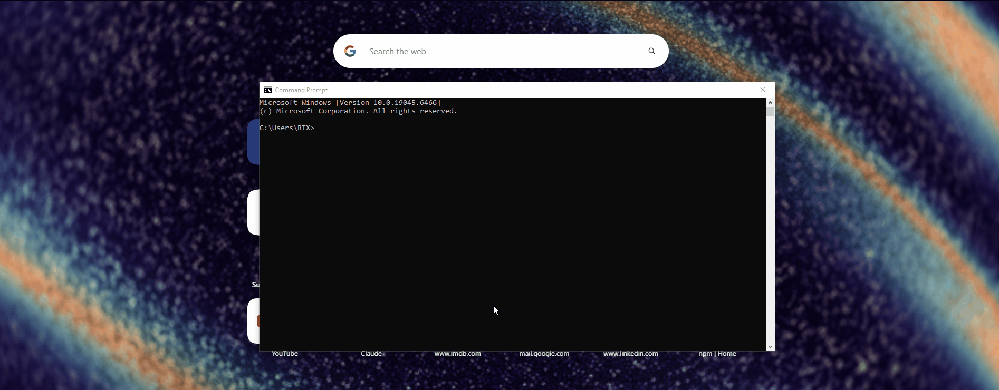

# instagui

**Any CLI. Instant GUI. One command.**

As featured in [The Register](https://www.theregister.com/software/2026/07/07/new-tool-gives-clis-a-warm-and-gui-feeling-instead/5267798) · [](https://github.com/Soutar97/instagui/actions/workflows/ci.yml)

Turn any command-line tool into a clean local web form — no config, no code changes to the tool.

<!-- TODO(pre-launch): record and drop the money-demo GIF here.
     ~10s: `npx instagui ffmpeg` → browser opens → fill a couple fields → Run → output streams.
     Save as docs/demo.gif and it renders below. -->


```sh
npx instagui ffmpeg
```

That's it. instagui reads the tool's `--help`, turns it into a web form, opens your browser, and
(when you click **Run**) executes the command locally and streams the output back — while always
showing you the exact command it will run, so it teaches you the CLI instead of hiding it.

---

## Why

Thousands of powerful CLIs (ffmpeg, pandoc, yt-dlp, curl, imagemagick…) are unfriendly to anyone
who doesn't live in a terminal — and even experts re-read man pages to recall flag syntax. Tools
like Gooey require the tool's *author* to change their code. instagui needs nothing from the tool: it
parses the tool's own `--help` text with AI into a structured schema and renders that as a form.

## Quick start

The three demo tools ship with **bundled schemas**, so they work instantly with **no API key**:

```sh
npx instagui ffmpeg      # video/audio transcoding
npx instagui yt-dlp      # download media
npx instagui pandoc      # convert documents
```

For any *other* tool, instagui extracts the schema on first run using the Claude API (see
[How it stays free](#how-it-stays-free)):

```sh
export ANTHROPIC_API_KEY=sk-ant-...    # POSIX
$env:ANTHROPIC_API_KEY="sk-ant-..."    # Windows / PowerShell
npx instagui curl
```

Get a key at <https://console.anthropic.com>. The first extraction is cached, so every launch
after that is instant and free.

## Choosing an AI engine

Fresh extraction (a tool that isn't bundled or cached) needs an AI engine, but you rarely have to
pick one yourself: instagui **auto-detects** what you already have.

**Selection order** (first hit wins):

1. `--engine <name>` on the command line
2. `INSTAGUI_ENGINE` environment variable
3. `default` in `~/.instagui/config.json`
4. **auto-detect** — a set API key wins; otherwise a logged-in CLI:
   1. `ANTHROPIC_API_KEY` → `OPENAI_API_KEY` → `GEMINI_API_KEY` → `DEEPSEEK_API_KEY` (first that's set)
   2. else `claude` → `codex` → `gemini` (first CLI found on `PATH`)

So if you already have a Claude/ChatGPT/Gemini API key exported, or you're logged into the
`claude`, `codex`, or `gemini` CLI, instagui just uses it — no flags needed. **A set API key
always wins over a logged-in CLI**, so existing key-based setups keep working exactly as before.

Run `instagui --engines` to see every configured engine and whether it's ready right now — for
each one it says exactly *why* (which key is set or not, or whether the CLI is on your `PATH`).
It never prints a key value, only its status:

```sh
$ npx instagui --engines
Available instagui AI engines (● = ready now):

  ○ anthropic  anthropic          ANTHROPIC_API_KEY: not set
  ● openai     openai-compatible  OPENAI_API_KEY: set
  ○ google     openai-compatible  GEMINI_API_KEY: not set
  ○ deepseek   openai-compatible  DEEPSEEK_API_KEY: not set
  ● ollama     openai-compatible  local endpoint (http://localhost:11434/v1) — no key needed
  ○ claude     cli                claude CLI — not found on PATH
  ● codex      cli                codex CLI — found on PATH
  ○ gemini     cli                gemini CLI — not found on PATH
```

So instagui never asks you to put a key in a file — you set the relevant **environment variable**
(the one named in each row), and `--engines` confirms it's picked up.

Pick one explicitly with `--engine <name>`:

```sh
npx instagui curl --engine claude    # use the claude CLI (no API key needed, just `claude` login)
npx instagui curl --engine openai    # use the OpenAI API (needs OPENAI_API_KEY)
```

Built-in engine names, no config required:

| Name | Kind | Auth |
| --- | --- | --- |
| `anthropic` | Anthropic API | `ANTHROPIC_API_KEY` |
| `openai` | OpenAI API | `OPENAI_API_KEY` |
| `google` | Gemini API (OpenAI-compatible endpoint) | `GEMINI_API_KEY` |
| `deepseek` | DeepSeek API (OpenAI-compatible) | `DEEPSEEK_API_KEY` |
| `ollama` | local Ollama server | none (local) |
| `claude` | Claude Code CLI (subscription) | `claude` login |
| `codex` | Codex CLI (subscription) | `codex` login |
| `gemini` | Gemini CLI (subscription) | `gemini` login |

To add another provider (e.g. Kimi/Moonshot, a hosted vLLM/LM Studio endpoint), change a default
model, or set a `default` engine, create `~/.instagui/config.json`:

```json
{
  "default": "claude",
  "engines": {
    "claude":   { "kind": "cli", "binary": "claude", "model": "sonnet" },
    "anthropic":{ "kind": "anthropic", "keyEnv": "ANTHROPIC_API_KEY", "model": "claude-haiku-4-5" },
    "openai":   { "kind": "openai-compatible", "baseURL": "https://api.openai.com/v1", "keyEnv": "OPENAI_API_KEY", "model": "gpt-4o-mini" },
    "google":   { "kind": "openai-compatible", "baseURL": "https://generativelanguage.googleapis.com/v1beta/openai/", "keyEnv": "GEMINI_API_KEY", "model": "gemini-2.5-flash" },
    "ollama":   { "kind": "openai-compatible", "baseURL": "http://localhost:11434/v1", "model": "llama3.1" },
    "kimi":     { "kind": "openai-compatible", "baseURL": "https://api.moonshot.cn/v1", "keyEnv": "MOONSHOT_API_KEY", "model": "moonshot-v1-8k" }
  }
}
```

`engines` entries are merged **over** the built-ins (same name overrides). `keyEnv` names an
**environment variable** that holds the key — instagui never reads a raw key from disk, and a
config that puts a plaintext `key` in the file is rejected with an error pointing you back to `keyEnv`.

None of this applies to the bundled demo tools: `ffmpeg`, `yt-dlp`, and `pandoc` resolve from
shipped schemas and need **no engine at all**, ready or not.

## How it works

1. **Capture** — run `<tool> --help` (falling back to `-h`, `help`, then the man page), reading
   both stdout and stderr, under a timeout and size cap so a misbehaving tool can't hang the launch.
2. **Extract** — send the help text to the Claude API (`claude-haiku-4-5`) and get back a validated
   JSON schema of the tool's options (name, flag, type, description, enum values, required, grouping)
   plus positional arguments. Invalid output is retried once, then fails clearly.
3. **Serve** — render the schema as a single-page form on `http://127.0.0.1`, grouped, with the
   right control per type (checkbox / dropdown / number / text).
4. **Preview** — show the exact command as you edit the form, one-click copyable.
5. **Run** — execute the command with `spawn` (arguments array, never a shell string) and stream
   stdout/stderr live into the page until it exits.

## How it stays free

instagui resolves a schema in this order, and only the last step costs an API call:

| Precedence | Source | Needs a key? |
| --- | --- | --- |
| 1 | `--schema <file>` override you supply | no |
| 2 | Your cache in `~/.instagui/` (written on first extraction) | no |
| 3 | Bundled schemas shipped with the package (ffmpeg, yt-dlp, pandoc) | no |
| 4 | Fresh extraction via your selected AI engine | **yes** (a key or a logged-in CLI — see [Choosing an AI engine](#choosing-an-ai-engine)) |

So the demo tools are free forever, any tool you've used once is free forever after, and you only
need a working engine the first time you point instagui at a brand-new tool. A friendly message
tells you exactly what to do if none is configured — you're never dropped into a stack trace.

- `--refresh` re-extracts and overwrites your cache entry.
- `--schema ./mytool.json` uses a hand-tuned schema and skips capture **and** the AI entirely.

## Usage

```
instagui <tool>                 resolve <tool>'s Schema and serve the Form (auto-opens the browser)
instagui <tool> --print         resolve and print the Schema JSON instead of serving
instagui <tool> --schema <path> use a hand-supplied Schema file (no capture, no AI)
instagui <tool> --refresh       ignore cache + bundled and re-extract fresh
instagui <tool> --help-file <p> extract from a captured help-text file
<tool> --help | instagui <tool> or pipe help text on stdin

  --port <n>     preferred port for the Form server (default 5177; falls back if busy)
  --no-open      do not auto-open the browser (still prints the URL)
  --model <id>   extraction model (default: claude-haiku-4-5)
  --engine <name> AI engine: anthropic | openai | google | deepseek | ollama | claude | codex
                 | gemini | any engine in ~/.instagui/config.json. Default: auto-detect.
  --engines      list engines + whether each is ready (which key is set / CLI on PATH), then exit
  -v, --version  print the instagui version
  -h, --help     show help
```

## Using instagui over SSH

The form is served on `127.0.0.1` on the **remote** machine, so opening a browser there is
useless. When instagui detects an SSH session (`SSH_CONNECTION` / `SSH_TTY`) it **skips the
browser auto-open** and prints a copy-ready port-forward hint after the listening line:

```
$ instagui ffmpeg
http://127.0.0.1:5177/
instagui: Running over SSH. On your local machine run:
  ssh -L 5177:127.0.0.1:5177 <user>@<host>
then open http://127.0.0.1:5177
```

Run that `ssh -L` command in a terminal **on your local machine**, then open
`http://127.0.0.1:5177` there — the tunnel forwards your local port to the remote form.
`<host>` is filled in from `SSH_CONNECTION` when available; `<user>` (and an unknown host) stay
as placeholders for you to edit. The forwarded port always matches the port instagui bound
(pass `--port <n>` to pick it; it falls back to a free port if busy). Nothing about the binding
changes — the server is still `127.0.0.1`-only, reachable only through your own tunnel.

### Persistent sessions

Plain `ssh -L` is fine for a quick session, but the tunnel dies with the connection. For a
long-lived tunnel to a box you keep coming back to, use `autossh` instead:

```sh
autossh -M 0 -N -f -L 5177:127.0.0.1:5177 <user>@<host>
```

It re-establishes the forward automatically after a network drop, so the form stays reachable
without you re-running the command each time.

## Security / threat model

instagui is a **local, single-user tool**. Be clear-eyed about what it does:

- **It runs commands you compose.** The whole point is to execute a real CLI with the arguments you
  set in the form. Treat the form like your own terminal — don't run something you wouldn't type.
- **The exact command is always shown before you Run it.** No hidden arguments; preview is generated
  from the *same* argument array that Run executes, so what you see is what runs.
- **Arguments are passed as an array to `spawn`, never concatenated into a shell.** A value
  containing spaces, quotes, `;`, or `&&` is passed verbatim as a single argument — there is no
  shell to interpret it, so form input can't inject extra commands.
- **The server binds `127.0.0.1` only.** It is not reachable from your network.
- **State-changing requests fail closed.** `POST /run` and `POST /stop` require a matching `Origin`
  header; a missing or foreign origin is rejected (CSRF protection). Exactly one run at a time, and
  closing the tab (dropping the stream) kills the child process — no orphans.
- **Your API key is never logged, echoed, or embedded in any served page.** The only data that
  leaves your machine is the tool's help text, sent to your selected AI engine for extraction
  (nowhere, for a local `ollama` engine). No telemetry.

## Contribute a schema

Want a tool to work keyless for everyone, like the demo tools do? Bundled schemas live in
[`schemas/`](schemas/) and are generated from captured `--help` fixtures:

1. Capture the tool's help into `test/fixtures/<tool>-help.txt`.
2. Add the tool to `scripts/gen-bundled-schemas.ts`.
3. Regenerate with your key: `ANTHROPIC_API_KEY=sk-ant-... npx tsx scripts/gen-bundled-schemas.ts`
   (a hallucination guard + golden check run before anything is written).
4. Open a PR with the fixture and the generated `schemas/<tool>.json`.

Each generated schema is validated so every flag appears verbatim in the source help text — no
hallucinated options. See [`schemas/README.md`](schemas/README.md) for provenance details.

## Requirements

- **Node.js ≥ 22**
- An AI engine — an API key (`ANTHROPIC_API_KEY`, `OPENAI_API_KEY`, `GEMINI_API_KEY`, ...) or a
  logged-in CLI (`claude`, `codex`, `gemini`) — only for extracting a tool that isn't bundled or
  cached. See [Choosing an AI engine](#choosing-an-ai-engine).

## Non-goals (v0.1)

Deliberately out of scope to keep it small and sharp: interactive/TUI programs (vim, top, REPLs);
subcommand trees (flat tools only — `git commit` vs `git push` is v0.2); native file-picker dialogs;
a hosted version, auth, telemetry, or a plugin system.

## License

MIT © Omar
